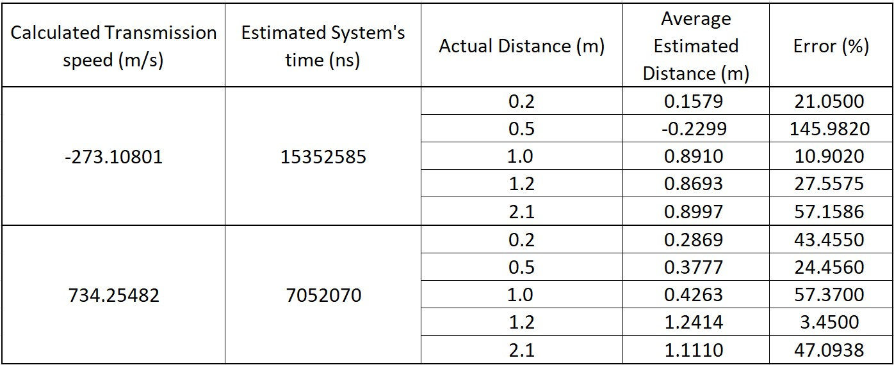

# DistanceMeasure_ToF
This project is made to program a PC and an ESP32 to measure distance between 2 devices.

# Description
+ The "PC_MeasureDistanceToF" contains the Python script for a PC connects to an UDP Server,
send and receive messages, measures the Time of Fight (ToF) of the message and calculates
the distance.
+ The "ESP32_MeasureDistanceToF_AP" contains the programs for an ESP32 create an UDP Server, 
when receive a message, it will immediately send back to the Client that is connecting the
specified port.
+ Both project's programs were made on VS Code.

# Results and Reviews
+ Below is the result's data.

+ As you can see, the error is pretty large, from few to over 100 %. If we ignore the case
where the transmission's velocity is negative, the error is still go up to 50 %.
+ There are a number of issues that I think will improve measurement results:
  * Using more appropriate hardwares for measuring Time of Flight (ToF) of the message via WIfi
  * Using CSI data to get better timming
  * Improving the programs for better and faster reading
+ Even though I did this project just for fun and to satisfy my curiosity, I also don't mind listening
to your comments. If you want to ask questions, you can contact me at the address below.

# Youtube Channel
+ You can watch this project's video on Youtube: 
+ If you can, please support me on my Youtube's channel: @ElectricalThinking29.

# Contact
+ E-mail: electricalthinking29@gmail.com

# License
Copyright 2023 @ElectricalThinking29

Licensed under the Apache License, Version 2.0 (the "License");
you may not use this file except in compliance with the License.
You may obtain a copy of the License at

    http://www.apache.org/licenses/LICENSE-2.0

Unless required by applicable law or agreed to in writing, software
distributed under the License is distributed on an "AS IS" BASIS,
WITHOUT WARRANTIES OR CONDITIONS OF ANY KIND, either express or implied.
See the License for the specific language governing permissions and
limitations under the License.
